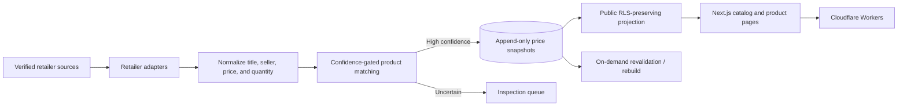

# ViewtyPick

**A trust-first Korean beauty discovery and price-comparison product.**

ViewtyPick helps shoppers discover curated cosmetics and compare prices only across verified retailers. The system treats product identity and price as high-risk data: uncertain matches are withheld for review instead of being shown as a potentially wrong bargain.

[Live app](https://www.viewtypick.com) · [Source](https://github.com/Lily-Eunah/viewty-pick)


## What this project demonstrates

- **Trust-aware data engineering:** retailer offers pass identity, seller, quantity, and confidence checks before publication.
- **Production price collection:** adapters normalize data from Naver Shopping, Coupang Partners, and OliveYoung-linked sources.
- **Fail-safe operations:** missing or uncertain data becomes `no price` or a review item; the system never fabricates a price.
- **Edge-first delivery:** Next.js runs on Cloudflare Workers through OpenNext, backed by Supabase/PostgreSQL.
- **Search-driven product design:** statically generated catalog and intent pages expose complete, indexable buying guidance.

## Selected outcomes

| Area | Result |
| --- | --- |
| Matching quality | Recorded validation reached **0 wrong-product prices across the catalog**, with roughly **85% offer coverage** at that snapshot |
| LLM efficiency | A regex-first, LLM-fallback title parser reduced Gemini traffic from **54% to 28%** in shadow validation |
| Web data access | Server components and batched queries reduced browser-visible Supabase requests from **8–9 to 0** |
| Edge reliability | Reworked dynamic catalog routes into build-time output after tracing failures to Cloudflare Workers' CPU limit |
| Personalization | Shipped a 10-question skin-type flow with deterministic scoring and **48 statically generated result pages** |

Metrics above describe recorded validation snapshots and should be updated as the catalog changes.

## Data pipeline



The central rule is simple: **a wrong price is worse than no price**. The pipeline keeps the last known good image and price where appropriate, isolates uncertain identity matches, and requires explicit opt-in before any crawler can write to production.

## Core engineering decisions

### Confidence-gated matching

Offers are evaluated through multiple identity signals rather than title similarity alone. Seller trust, normalized brand and product names, package quantity, and retailer-specific identifiers determine whether an offer is published or sent for inspection.

### Canonical quantity model

Retailer-specific package expressions are converted through one canonical-unit gateway. This makes per-unit comparisons possible across `ml`, `g`, and sheet-count products without scattering parsing rules through the UI.

### Append-only pricing

Price observations are stored as history rather than overwritten in place. The public web layer reads through a restricted projection so product pages can show current offers without exposing operational columns.

### Compliance-aware collection

The crawler respects retailer constraints, rate limits, and source-specific collection paths. A WAF-protected retailer is collected through a locally scheduled, headful workflow after read-only probes showed datacenter traffic was blocked. Failure paths preserve prior good data and never invent results.

### Edge deployment

The application runs on Cloudflare Workers through OpenNext. Catalog pages are generated ahead of time where possible, while crawler-triggered rebuilds and revalidation keep data fresh within the platform's CPU budget.

## Product surface

- Curated product and category discovery
- Verified-retailer price comparison
- Canonical per-unit pricing and discount context
- Evidence and recommendation badges
- Search and 40+ intent-focused SEO landing pages
- Ten-question skin-type assessment with personalized product recommendations
- Operator workflows for catalog maintenance, inspection, backups, and crawl control

## Tech stack

| Layer | Technology |
| --- | --- |
| Application | Next.js 16, React 19, TypeScript |
| Edge runtime | Cloudflare Workers, OpenNext, Wrangler |
| Data | Supabase, PostgreSQL, Row Level Security |
| Collection | Retailer adapters, Playwright, scheduled workflows |
| Validation | Zod, deterministic matching tests, shadow evaluation |
| Operations | GitHub Actions, Google Sheets operator workflows, Discord alerts |

## Repository structure

```text
app/                  Next.js routes and server-rendered product surfaces
components/           Product, commerce, search, and skin-test UI
crawler/              Retailer adapters, normalization, matching, and tests
lib/queries/          Restricted public-data access layer
scripts/ops/          Backup, audit, import, and controlled maintenance tools
scripts/live-check/   Read-only production verification
supabase/migrations/  Additive database migrations and public projections
```

## Run locally

### Prerequisites

- Node.js 20 or newer
- npm

```bash
npm ci
npm run dev
```

The local application runs at `http://localhost:3000`.

Production-backed collection and operator commands require external credentials. Keep them in an untracked local environment file. Do not run `crawler:sync` against real credentials unless a production write is intentional, backed up, and explicitly enabled.

## Verify changes

```bash
npm run lint
npm run typecheck
npm run test:all
npm run build
```

For changes that depend on the Cloudflare runtime, also run:

```bash
npm run cf:build
```

The crawler's safe local path is `npm run crawler:test`; live checks under `scripts/live-check/` are intended to be read-only diagnostics.

## Author

Built by [Eunah (Lily) Yang](https://www.linkedin.com/in/eunah-yang-3a86553a4/).

## License

No open-source license is currently granted. The source is publicly available for portfolio review; all rights are reserved unless a license is added.
